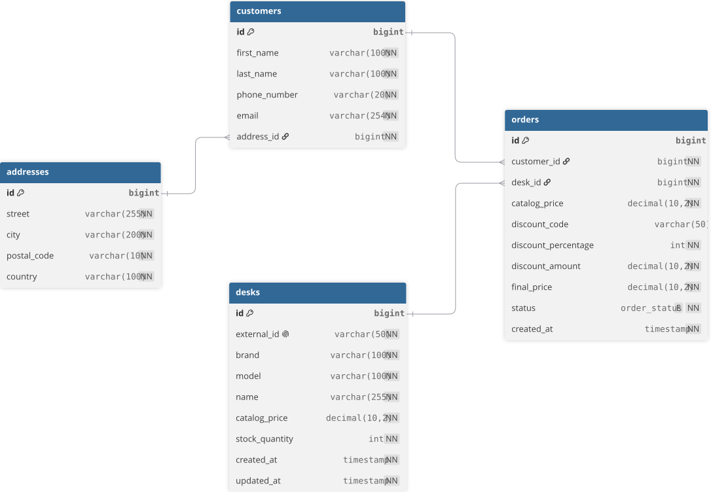

# Desk Order & Reservation System (API)

A robust RESTful API built with **Python** and **Django REST Framework (DRF)** for handling desk purchasing and reservation workflows, including customer data validation, automated discount processing, and order state management.

---

## Project Overview

This project simulates a real-world e-commerce backend designed to handle workspace product orders. It bridges the gap between frontend form submissions and backend database persistence by enforcing strict data validation schemas, automated price calculations, and structured error handling.

### Key Features
* **Nested Order Schemas:** Clean separation of concern across `Customer`, `Address`, `Product`, and `Financial Summary` domains using DRF Serializers.
* **Automated Price & Discount Validation:** Multi-field validation ensuring catalog prices, discount percentages/amounts, and final amounts match mathematically before reaching the database.
* **REST-Compliant Data Structures:** Standardized JSON request and response payloads with comprehensive HTTP status code usage.
* **Scalable Architecture:** Built following Django best practices with isolated domain applications (`orders`, `desks`).

---

## Tech Stack

* **Language:** Python 3.11+
* **Framework:** Django 5.x, Django REST Framework (DRF)
* **Data Interchange:** JSON (Schema design with ISO-8601 datetimes, Decimal precision for financial values)
* **Database:** PostgreSQL
* **Containerization:** Docker & Docker Compose

---

## Database Schema 



---

## Example Request Payload (For current version)

```json
{
  "{
  "customer": {
    "firstName": "Jan",
    "lastName": "Kowalski",
    "phoneNumber": "+48600111222",
    "email": "jan.kowalski@example.com",
    "address": {
      "street": "Marszałkowska 10/12",
      "city": "Warszawa",
      "postalCode": "00-001",
      "country": "Polska"
    }
  },
  "product": {
    "id": "desk_9821"
  },
  "discount": {
    "isCodeApplied": true,
    "discountCode": "LATO2026",
    "discountPercentage": 10,
    "discountAmountPLN": 129.90
  },
  "summary": {
    "finalAmountPLN": 1169.10,
    "currency": "PLN"
  }
}
  }
}